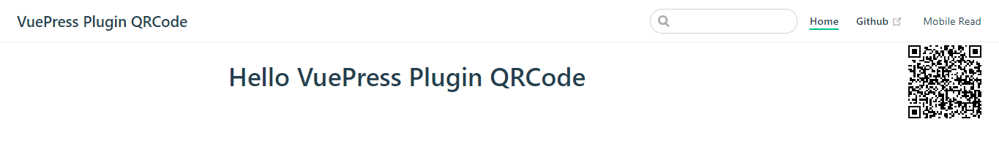

<div align="center">

Vuepress Plugin Qrcode


[](https://github.com/openHacking/vuepress-plugin-qrcode)
</div>

简体中文 | [English](./README.md)

## 介绍

Vuepress Plugin Qrcode是一个展示当前网址二维码供移动设备扫描的Vuepress插件

## 文档

- [官方Demo](https://openhacking.github.io/vuepress-template/zh/)
- [社区案例](https://dushusir.github.io/blog/)



## 安装

```sh
yarn add -D vuepress-plugin-qrcode
# OR npm install -D vuepress-plugin-qrcode
```

## 使用

不加配置直接使用
```js
module.exports = {
  plugins: ['qrcode']
}
```
或者，设置可选配置
```js
module.exports = {
  plugins: [
    ['qrcode',{
        labelText:'Mobile Read',
        size:'small'
    }]
  ]
}
```

## 配置(可选)

### labelText
- Type: `string`
- Default: `Mobile Read`   
点击按钮弹出二维码，按钮的文字

### size
- Type: `string | number`
- Default: `small`    
设置二维码大小，可能的值有
    - `small`：代表100px * 100px
    - `medium`：代表150px * 150px
    - `big`：代表200px * 200px

    或者设定你认为合适的具体数值，比如
    - `80`：代表80px * 80px
    - `120`：代表120px * 120px

## 赞助

如果你觉得这个项目对你有用或者有所启发，可以请作者喝杯果汁：
| 微信捐赠  | 支付宝捐赠
|---|---|
| | 

并联系作者加到赞助者列表： alexliu518@gmail.com

## 赞助者列表

- [Dushusir](https://dushusir.github.io)

## 资源

- [vuepress](https://vuepress.vuejs.org/)
- [vuepress plugins](https://github.com/vuepress/awesome-vuepress#plugins)